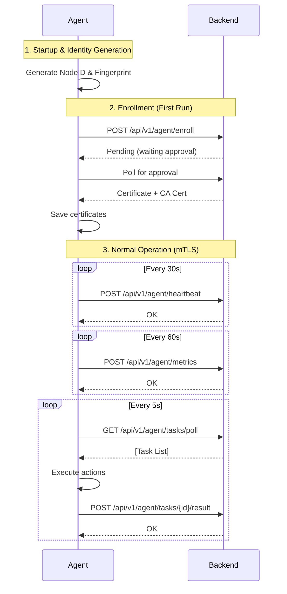
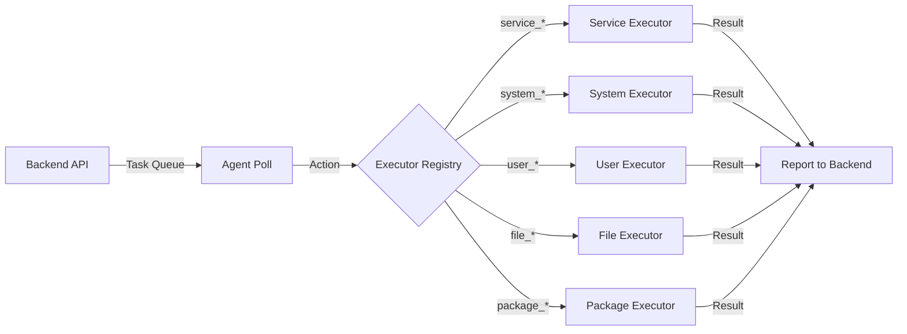

# EINFRA Agent

<div align="center">

**Zero-Trust, Cross-Platform Infrastructure Agent**

[](https://go.dev/)
[](https://github.com/einfra/einfra_agent)
[](LICENSE)
[](https://github.com/einfra/einfra_agent)

[Features](#-features) • [Architecture](#-architecture) • [Quick Start](#-quick-start) • [Security](#-security) • [Documentation](#-documentation)

</div>

---

## 📖 Overview

**EINFRA Agent** is a lightweight, secure, and action-based infrastructure management agent designed for modern cloud and on-premise environments. It provides zero-trust server management without requiring SSH access, using mTLS for secure communication and action-based execution to prevent arbitrary command injection.

### Why EINFRA Agent?

- 🔒 **Zero-Trust Security** - No SSH required, mTLS authentication, certificate-based identity
- 🚀 **Action-Based Execution** - Predefined actions only, no arbitrary shell commands
- 🌐 **Cross-Platform** - Native support for Linux and Windows
- 📊 **Real-Time Monitoring** - Continuous system metrics collection and reporting
- 🔄 **Auto-Enrollment** - Token-based registration with approval workflow
- 🧩 **Modular Architecture** - Pluggable executor system for extensibility

---

## ✨ Features

### Core Capabilities

- ✅ **Automatic Enrollment** - Token-based registration with backend approval workflow
- ✅ **mTLS Communication** - Mutual TLS authentication for all agent-backend communication
- ✅ **Hardware Fingerprinting** - Unique identity generation based on hardware characteristics
- ✅ **Outbound-Only Connections** - Agent initiates all connections, no inbound ports required
- ✅ **Structured Logging** - Console, text file, and JSON logging with configurable levels
- ✅ **Graceful Shutdown** - Proper signal handling and resource cleanup

### Modular Executors

#### 🔧 Service Management
- List all system services
- Start, stop, restart services
- Enable/disable services at boot
- Cross-platform support (systemd/systemctl on Linux, SCM on Windows)

#### 📊 System Monitoring
- Real-time CPU, RAM, disk, and network metrics
- System information (OS, kernel, uptime)
- Process listing and monitoring
- Periodic metric collection and reporting

#### 👥 User Management
- List users and groups
- Create and delete users
- User permission management
- Cross-platform user operations

#### 📁 File Operations
- Directory listing and navigation
- File reading (with size limits)
- File and directory deletion
- Permission management (chmod on Linux)
- Directory creation

#### 📦 Package Management
- List installed packages
- Install packages
- Support for apt, yum, dnf (Linux) and Chocolatey (Windows)

#### 🐳 Docker Management *(Coming Soon)*
- Container lifecycle management
- Image operations
- Network and volume management

---

## 🏗️ Architecture

### Project Structure

```
agent/
├── cmd/
│   └── agent/              # Application entry point
│       └── main.go         # Main executable
│
├── internal/
│   ├── config/             # Configuration management
│   │   └── config.go       # Config loading and defaults
│   │
│   ├── identity/           # Agent identity
│   │   └── identity.go     # NodeID & fingerprint generation
│   │
│   ├── transport/          # HTTP communication
│   │   └── client.go       # mTLS HTTP client
│   │
│   ├── enroll/             # Enrollment workflow
│   │   └── client.go       # Enrollment logic and CSR generation
│   │
│   ├── executor/           # Action execution framework
│   │   ├── executor.go     # Registry and base types
│   │   ├── service/        # Service management executor
│   │   ├── system/         # System monitoring executor
│   │   ├── user/           # User management executor
│   │   ├── file/           # File operations executor
│   │   ├── package/        # Package management executor
│   │   └── docker/         # Docker management executor
│   │
│   ├── monitor/            # Metrics collection
│   │   └── collector.go    # Periodic metric collector
│   │
│   └── logger/             # Logging system
│       └── logger.go       # Multi-output structured logging
│
└── bin/                    # Compiled binaries
```

### Communication Flow



### Action Execution Model



---

## 🚀 Quick Start

### Prerequisites

- **Go** 1.24.2 or higher ([Download](https://go.dev/dl/))
- **Backend Server** - EINFRA backend must be running and accessible
- **Enrollment Token** - Obtain from backend administrator

### Installation

#### Option 1: Build from Source

```bash
# Clone the repository
git clone https://github.com/einfra/einfra_agent.git
cd einfra_agent/agent

# Install dependencies
go mod download

# Build the agent
go build -o bin/agent ./cmd/agent

# Verify build
./bin/agent --help
```

#### Option 2: Download Pre-built Binary

```bash
# Linux (x64)
wget https://releases.einfra.io/agent/latest/agent-linux-amd64
chmod +x agent-linux-amd64
sudo mv agent-linux-amd64 /usr/local/bin/einfra_agent

# Windows (x64)
# Download from: https://releases.einfra.io/agent/latest/agent-windows-amd64.exe
```

### Configuration

#### Environment Variables

```bash
# Required
export EINFRA_BACKEND_URL=https://backend.example.com
export EINFRA_ENROLL_TOKEN=your-enrollment-token-here

# Optional
export EINFRA_LOG_LEVEL=info          # debug, info, warn, error
export EINFRA_HEARTBEAT_INTERVAL=30   # seconds
export EINFRA_METRIC_INTERVAL=60      # seconds
```

#### Configuration File

Alternatively, create a configuration file:

**Linux**: `/var/lib/einfra_agent/config.json`
**Windows**: `C:\ProgramData\einfra\agent\config.json`

```json
{
  "backend_url": "https://backend.example.com",
  "enroll_token": "your-enrollment-token-here",
  "log_level": "info",
  "log_dir": "/var/log/einfra_agent",
  "cert_path": "/var/lib/einfra_agent/certs/agent.crt",
  "key_path": "/var/lib/einfra_agent/certs/agent.key",
  "ca_cert_path": "/var/lib/einfra_agent/certs/ca.crt",
  "heartbeat_interval": 30,
  "metric_interval": 60
}
```

### Running the Agent

#### Linux

```bash
# Run directly
sudo ./bin/agent

# Run with custom config
sudo ./bin/agent --config /path/to/config.json

# Run as systemd service (recommended)
sudo systemctl start einfra_agent
sudo systemctl enable einfra_agent
```

#### Windows

```powershell
# Run as Administrator
.\bin\agent.exe

# Run with custom config
.\bin\agent.exe --config C:\path\to\config.json

# Install as Windows Service (recommended)
.\bin\agent.exe install
Start-Service einfra_agent
```

### First Run - Enrollment

On first run, the agent will:

1. ✅ Generate a unique NodeID and hardware fingerprint
2. ✅ Send enrollment request to backend
3. ⏳ Wait for administrator approval
4. ✅ Receive and save mTLS certificates
5. ✅ Begin normal operation

**Expected Output:**

```
2026-01-10T10:00:00Z INF EINFRA Agent starting...
2026-01-10T10:00:00Z INF Agent identity generated node_id=node_abc123 fingerprint=fp_xyz789 hostname=server01
2026-01-10T10:00:00Z INF Agent not enrolled, starting enrollment...
2026-01-10T10:00:05Z INF Waiting for approval...
2026-01-10T10:01:00Z INF Enrollment completed successfully
2026-01-10T10:01:00Z INF mTLS enabled
2026-01-10T10:01:00Z INF Executor registry initialized
2026-01-10T10:01:00Z INF Heartbeat loop started
2026-01-10T10:01:00Z INF Task polling loop started
```

---

## 🔒 Security

### Zero-Trust Architecture

EINFRA Agent implements a zero-trust security model:

- ✅ **No SSH Required** - Agent connects outbound only, no inbound ports
- ✅ **mTLS Authentication** - Mutual TLS for all communication after enrollment
- ✅ **Certificate-Based Identity** - Hardware-bound certificates
- ✅ **Action Whitelist** - Only predefined actions can be executed
- ✅ **No Shell Execution** - No arbitrary command execution from backend

### Enrollment Security

1. **Token-Based Registration** - One-time enrollment token required
2. **Admin Approval** - Backend administrator must approve new agents
3. **Certificate Issuance** - Signed certificates issued only after approval
4. **Hardware Fingerprinting** - Identity tied to hardware characteristics

### Communication Security

- All communication uses **TLS 1.3**
- Client and server certificates verified on every request
- Certificate pinning prevents MITM attacks
- Automatic certificate rotation support

### Action Security

- Actions are **strongly typed** and validated
- Input sanitization on all parameters
- File operations restricted to allowed paths
- Service operations require proper permissions
- Package installations from trusted repositories only

---

## 📚 Supported Actions

### Service Management

| Action | Description | Parameters | Platform |
|--------|-------------|------------|----------|
| `service_list` | List all services | - | Linux, Windows |
| `service_start` | Start a service | `name` | Linux, Windows |
| `service_stop` | Stop a service | `name` | Linux, Windows |
| `service_restart` | Restart a service | `name` | Linux, Windows |
| `service_enable` | Enable at boot | `name` | Linux, Windows |
| `service_disable` | Disable at boot | `name` | Linux, Windows |

### System Monitoring

| Action | Description | Parameters | Platform |
|--------|-------------|------------|----------|
| `system_info` | Get OS, kernel, uptime | - | Linux, Windows |
| `system_metrics` | Get CPU, RAM, disk, network | - | Linux, Windows |
| `process_list` | List running processes | - | Linux, Windows |

### User Management

| Action | Description | Parameters | Platform |
|--------|-------------|------------|----------|
| `user_list` | List all users | - | Linux, Windows |
| `user_add` | Create new user | `username`, `password` | Linux, Windows |
| `user_delete` | Remove user | `username` | Linux, Windows |
| `group_list` | List all groups | - | Linux, Windows |

### File Operations

| Action | Description | Parameters | Platform |
|--------|-------------|------------|----------|
| `file_list` | List directory | `path` | Linux, Windows |
| `file_read` | Read file (max 1MB) | `path` | Linux, Windows |
| `file_delete` | Delete file | `path` | Linux, Windows |
| `file_chmod` | Change permissions | `path`, `mode` | Linux |
| `dir_create` | Create directory | `path` | Linux, Windows |

### Package Management

| Action | Description | Parameters | Platform |
|--------|-------------|------------|----------|
| `package_list` | List installed packages | - | Linux, Windows |
| `package_install` | Install package | `name` | Linux, Windows |

---

## 📊 Monitoring & Logging

### Metrics Collection

The agent automatically collects and reports metrics every 60 seconds (configurable):

- **CPU Usage** - Per-core and total utilization
- **Memory** - Total, used, free, available
- **Disk** - Usage per mount point/drive
- **Network** - Bytes sent/received per interface
- **System** - Uptime, load average, process count

### Logging

Logs are written to multiple outputs:

#### Console (Pretty Format)
```
2026-01-10T10:00:00Z INF Agent starting...
2026-01-10T10:00:01Z DBG Heartbeat sent
2026-01-10T10:00:05Z WRN Task poll failed error="connection timeout"
```

#### Text File (`agent.log`)
```
time=2026-01-10T10:00:00Z level=info message="Agent starting..."
time=2026-01-10T10:00:01Z level=debug message="Heartbeat sent"
```

#### JSON File (`agent.json`)
```json
{"time":"2026-01-10T10:00:00Z","level":"info","message":"Agent starting..."}
{"time":"2026-01-10T10:00:01Z","level":"debug","message":"Heartbeat sent"}
```

### Log Locations

| Platform | Directory |
|----------|-----------|
| Linux | `/var/log/einfra_agent/` |
| Windows | `C:\ProgramData\einfra\agent\logs\` |

### Log Levels

- `debug` - Verbose output for troubleshooting
- `info` - Normal operational messages (default)
- `warn` - Warning messages
- `error` - Error messages
- `fatal` - Critical errors (agent will exit)

---

## 🛠️ Development

### Building

```bash
# Build for current platform
go build -o bin/agent ./cmd/agent

# Build for Linux (from any platform)
GOOS=linux GOARCH=amd64 go build -o bin/agent-linux-amd64 ./cmd/agent

# Build for Windows (from any platform)
GOOS=windows GOARCH=amd64 go build -o bin/agent-windows-amd64.exe ./cmd/agent

# Build with version info
go build -ldflags "-X main.Version=1.0.0" -o bin/agent ./cmd/agent
```

### Testing

```bash
# Run all tests
go test ./...

# Run tests with coverage
go test -cover ./...

# Run tests with race detection
go test -race ./...

# Run specific package tests
go test ./internal/executor/service/...
```

### Code Quality

```bash
# Format code
go fmt ./...

# Vet code
go vet ./...

# Run linter (requires golangci-lint)
golangci-lint run

# Check for security issues (requires gosec)
gosec ./...
```

---

## 🐳 Deployment

### Systemd Service (Linux)

Create `/etc/systemd/system/einfra_agent.service`:

```ini
[Unit]
Description=EINFRA Infrastructure Agent
After=network.target

[Service]
Type=simple
User=root
ExecStart=/usr/local/bin/einfra_agent
Restart=always
RestartSec=10
Environment="EINFRA_BACKEND_URL=https://backend.example.com"
Environment="EINFRA_ENROLL_TOKEN=your-token"

[Install]
WantedBy=multi-user.target
```

```bash
sudo systemctl daemon-reload
sudo systemctl enable einfra_agent
sudo systemctl start einfra_agent
sudo systemctl status einfra_agent
```

### Windows Service

```powershell
# Install service
.\agent.exe install

# Start service
Start-Service einfra_agent

# Check status
Get-Service einfra_agent

# Uninstall service
.\agent.exe uninstall
```

### Docker Container

```dockerfile
FROM golang:1.24-alpine AS builder
WORKDIR /build
COPY . .
RUN go build -o agent ./cmd/agent

FROM alpine:latest
RUN apk --no-cache add ca-certificates
COPY --from=builder /build/agent /usr/local/bin/agent
ENTRYPOINT ["/usr/local/bin/agent"]
```

```bash
docker build -t einfra_agent:latest .
docker run -d --name einfra_agent \
  -e EINFRA_BACKEND_URL=https://backend.example.com \
  -e EINFRA_ENROLL_TOKEN=your-token \
  einfra_agent:latest
```

---

## 🤝 Contributing

We welcome contributions! Please follow these guidelines:

1. **Fork the repository**
2. **Create a feature branch** (`git checkout -b feature/new-executor`)
3. **Commit your changes** (`git commit -m 'feat: add new executor'`)
4. **Push to the branch** (`git push origin feature/new-executor`)
5. **Open a Pull Request**

### Adding a New Executor

1. Create a new package in `internal/executor/`
2. Implement the `Executor` interface
3. Register the executor in `cmd/agent/main.go`
4. Add tests
5. Update documentation

### Commit Convention

Follow [Conventional Commits](https://www.conventionalcommits.org/):

- `feat:` New feature
- `fix:` Bug fix
- `docs:` Documentation changes
- `refactor:` Code refactoring
- `test:` Adding tests
- `chore:` Maintenance

---

## 📄 License

**Proprietary** - EINFRA Project

This software is proprietary and confidential. Unauthorized copying, distribution, or use is strictly prohibited.

---

## 🙏 Acknowledgments

- Built with [Go](https://go.dev/)
- Logging by [Zerolog](https://github.com/rs/zerolog)
- System metrics by [gopsutil](https://github.com/shirou/gopsutil)
- UUID generation by [google/uuid](https://github.com/google/uuid)

---

## 📞 Support

- **Documentation**: [Wiki](https://github.com/einfra/einfra_agent/wiki)
- **Issues**: [GitHub Issues](https://github.com/einfra/einfra_agent/issues)
- **Security**: Report vulnerabilities to security@einfra.io

---

<div align="center">

**[⬆ Back to Top](#einfra_agent)**

Made with ❤️ by the EINFRA Team

</div>
# einfra_agent
